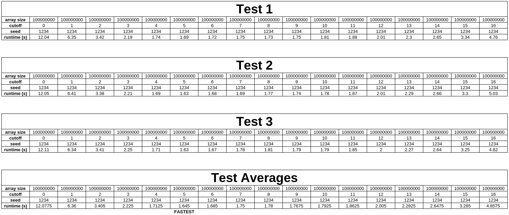

## Assignment 3 Concurrency  

- **Group name:** Assignment 3 Groups 36
- **Authors:**
  1. Shane Lee - a1888310
  2. Ethan Dankiw - a1885211
  3. Tony Le - a1908861

## Overview

This program will be a multithreaded paralleled version of the merge sort algorithm using the pthread library.
It will simply take the size of a random array, the level of parallelisation or the cutoff number and the seed as input 
and return the time it took to sort the randomised array.

## Manifest

A listing of source files and other non-generated files, and a brief (one-line) explanation of the purpose of each file.
- **README.md**
  - Explains the motivations for the project, compile and run commands, and testing data.
- **Makefile**
    - Outlines alias commands that can be entered into the terminal to compile, run and test the mergesort algorithm.
    - See the `Makefile` for available commands that can be executed.
- **test_data.png**
  - The raw testing data entered into the spreadsheet to calculate the cutoff value that produced the best runtime.
- **test_data.png**
  - The graph that visualised the average runtimes against the tested cutoff value.
- **src/mergesort.c**
  - The c file where the parallel and sequential mergesort algorithm logic is located.
- **src/mergesort.h**
  - The header file where function and variable definitions are located so they can be used in the mergesort algorithm.
- **src/test-mergesort.c**
  - The c file that is used to call the developed mergesort algorithm using a randomly generated array of values to sort,
  as well as timing the execution time of the algorithm before printing the result to stdout in the terminal.
- **build/test-mergesort**
  - The compiled test-mergesort binary is placed here so that it does not clutter the source directory.
  - The `build` directory is also used to store intermediary object files that are generated during compilation.

## Building the project

There are two ways to compile and run the program

### The automatic way

Automatically build and run by entering `make run_best` or `make run ARGS="<array_size> <cutoff_level> <seed>"`
- `make run_best` build and runs the code with the params `100000000 5 1234`.
  - These arguments were tested to result in the best runtime (see testing section for details).
- Both `make run` and `make run_best` has dependencies for the compiled build, so if the build missing or has changes 
in the source code were made. It will auto compile when needed.

### The manual way

To build and run the program you need to:
1. build by inputting `make all` on the terminal.
2. run by running `./build/test-mergesort <array_size> <cutoff_level> <seed>` in the terminal.

## Features and usage

Summarise the main features of your program. It is also appropriate to
instruct the user how to use your program.

Merge.c consists of 4 functions: merge, my_mergesort, buildArgs, parallel_mergesort
merge: function which will merge arrays into one
my_mergesort: Recursive sequential calls of merge
buildArgs: build arguments list with index to the left and right of the array and the level (how many times to split threads)
parallel_mergesort: Create threads for each level and calling merge once the threads a joined back in.

Note: See `Build the project` section for how to run the program.

## Testing

Our primary focus was to ensure that the code ran without any errors, so additional to the existing compile flags. 
Our group added the `-Werror` flag which treats all warnings as errors which prevents the build from being executed until
the code is 100% safe.

The testing phase primarily centered around using GradeScope as the source of truth. However, we always ensured that the 
code ran without errors locally, then tested a number of cutoff values (1, 2, 4, 8, 12, 16) to see which of those values 
resulted in a sorting time of less than 2 seconds. We decided to keep the array size and seed the same as those only changed
the input data, not the desired runtime.

These cutoff values are interpreted were tested 3 times and an average of the runtimes was computed in a spreadsheet.
Using the average runtime values, the best cutoff value was determined to be `5`.

### Testing data

## Known Bugs

List known bugs that you weren't able to fix (or ran out of time to fix).

## Reflection and Self Assessment

Discuss the issues you encountered during development and testing. 

**What problems did you have?** 

We had a problem with the performance of the parallel_mergesort underperforming 
and not speeding up enough with higher cutoffs.

**What did you have to research and learn on your own?**

We had to research the implementation of the mergesort in c and the implementation of 
parallel threading and methods to optimise all this to be memory efficient and quick.

**What kinds of errors did you get? How did you fix them?**

We had one error with double freeing the args because we were freeing the arg pointer 
in the mergesort.c file after finishing the threads but the args were already being freed in the test-mergesort.c 
file which caused the error to fix this we just removed the free in the mergesort.c file.

**What parts of the project did you find challenging? Is there anything that 
finally "clicked" for you in the process of working on this project?**

At first, we thought we needed locks and mutexes but as we broke down the problems, we realised that we didn't need 
locks since threads would work in independent areas of the array, and we would not need to consider race conditions.

**How well did the development and testing process go for you?**

The development process was quite simple. Most members had experience with threading and the merge sort algorithm so 
putting both concepts together wasn't too difficult. Testing was also relatively simple where we tested the code against 
a range of cutoff parameters to ensure the code was efficient and consistent

## Sources Used

1. https://www.geeksforgeeks.org/c/c-program-for-merge-sort/
2. https://pages.cs.wisc.edu/~remzi/OSTEP/threads-api.pdf

